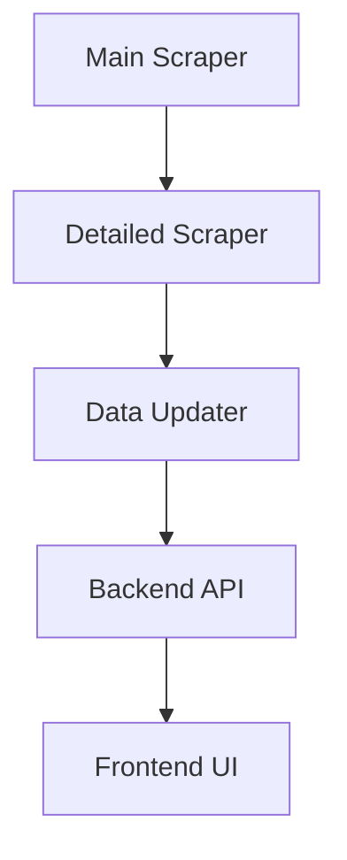

# Georgian Tender Analysis System

A production-ready system for scraping, analyzing, and monitoring Georgian government tenders from procurement.gov.ge.

---

### Overview



The system continuously scrapes Georgian procurement tenders, enriches them with detailed data, and provides a dashboard for analysis and monitoring.


## 🚀 Quick Start

### 1. Installation

```bash
# Install Python dependencies
pip install -r requirements.txt

# Install Playwright browsers
playwright install

# Install frontend dependencies
cd frontend && npm install
```

### 2. Start Servers

```bash
# Terminal 1: Start Backend (FastAPI)
cd backend
python3 -m venv venv
source venv/bin/activate
uvicorn app.main:app --reload

# Terminal 2: Start Frontend (React)
cd frontend
npm run dev
```

**Access:** Frontend at `http://localhost:3000`, Backend at `http://localhost:8000`

### 3. Main Workflows

#### Scrape Tenders
```bash
# Scrape CON tenders (automotive transport - CPV 60100000)
python3 main_scrapper/tender_scraper.py \
  --tender-type CON \
  --category-code 60100000 \
  --date-from 2025-01-01 \
  --headless true

# Scrape detailed information
python3 detailed_scraper/run_detailed_production.py \
  --tender-type CON \
  --concurrency 10 \
  --headless
```

#### Global Update (`update_all_tenders.py`)

This is the master script to update all data sources in one go.

**Features:**
- Updates all 10 tender types (CON, NAT, SPA, etc.) sequentially.
- **Granular Date Checking:** If a date range is provided (`--date-from`, `--date-to`), the script iterates **day-by-day**.
  - For each day, it checks the **Website Count** versus the **Local Count**.
  - If counts match, it skips scraping (saving time).
  - If counts mismatch, it scrapes only that specific day.
- **Auto-Correction:** If you provide the same Start and End date (e.g., `2025-12-11`), it automatically adjusts to cover the full 24-hour period (to `2025-12-12`).

**Arguments:**
- `--detailed`: Run detailed scraping (Step 2) immediately after main scraping. Slower but more complete.
- `--dry-run`: Simulate the update without saving data.
- `--type [TYPE]`: Update only a specific type (e.g., `CON`).
- `--date-from [YYYY-MM-DD]`: Start date for global check.
- `--date-to [YYYY-MM-DD]`: End date for global check.
- `--debug`: Enable verbose debug logging.

**Example:**
```bash
# Update everything (fast mode)
python3 update_all_tenders.py

# Check specific date range with debug info
python3 update_all_tenders.py --date-from 2025-12-01 --date-to 2025-12-05 --debug
```
# Dry run to see what would be updated
python3 update_all_tenders.py --dry-run
```

**Fast Mode vs Detailed Mode:**
- **Fast Mode** (default): Uses **Smart Incremental Updates**:
    1.  **Full Range Check**: Quickly checks website vs local counts for the full active date range (~5s).
    2.  **Smart Skip**: If counts match, **skips scraping entirely**.
    3.  **Granular Backward Check**: If mismatch found, backtracks day-by-day to find exact missing data.
    4.  **Optimized Scrape**: Scrapes ONLY the date range with missing data.
    - *Result: Daily updates reduced from ~2 mins to ~5-10 seconds!*
- **Detailed Mode** (`--detailed`): Runs main scraping + detailed scraping for complete data (~5-10 minutes).

**When to use each:**
- **Daily updates**: Use fast mode (default) - it now automatically handling incremental updates
- **Weekly deep sync**: Use detailed mode to ensure all deep details are up-to-date
- **Initial setup**: Use detailed mode to populate the database

**Output Example:**
```
📊 UPDATE SUMMARY
Total duration: 45.2 seconds (0.8 minutes)
Mode: MAIN ONLY

Results: 3 succeeded, 0 failed

✅ CON: CON (Automotive Transport)
   📊 Website reports: 2985 total tenders
   Tenders scraped: 2985
   ✅ SUCCESS: All tenders scraped correctly!
   Total tenders: 1105
   Active re-checked: 293
   New tenders: 0

✅ NAT: NAT (National)
   Total tenders: 8540
   Active re-checked: 450
   New tenders: 12

✅ SPA: SPA (Simplified)
   Total tenders: 438
   Active re-checked: 25
   New tenders: 3
```

#### Update Single Tender Type (Advanced)
```bash
# Update specific file with data_updater.py
python3 data_updater.py con_detailed_tenders.jsonl --dry-run
python3 data_updater.py nat_detailed_tenders.jsonl

# Schedule daily at 2 AM (updates all types)
0 2 * * * cd /path/to/project && python3 update_all_tenders.py >> logs/cron.log 2>&1
```

**Smart Scraping Optimization:**
The updater intelligently skips detailed scraping for tenders that haven't changed:
- ✅ **New tenders**: Always scrapes full details
- ✅ **Status changed**: Re-scrapes full details
- ⏭️ **Status unchanged**: Skips detailed scraping (saves time!)

**Date Range Logic:**
The updater uses a forward-looking approach:
- **Start**: Today - 2 days (safety buffer for recent updates)
- **End**: Today + 2 months (catches tenders with future deadlines)

Example (today is 2025-12-10):
- Scrapes from `2025-12-08` to `2026-02-10`
- This catches tenders announced today with deadlines up to 2 months in the future

Example output:
```
📊 Smart Scraping Analysis:
  - Tenders needing detailed scraping: 15
  - Tenders skipped (unchanged): 235
  - Time saved: ~470 seconds (estimated)
```

#### Check Status
```bash
# Check CON scraping status
python3 check_con_scraping_status.py

# View system health
# Navigate to: http://localhost:3000/system-health
```

#### Detailed Scraping Wrapper
A unified script `run_detailed_scraping.py` is available for flexible detailed scraping.

**1. Default Mode (Active Tenders Check):**
Scrapes all tenders with a deadline today or in the future that are missing detailed info.
```bash
python3 run_detailed_scraping.py
```

**2. Date Range Mode:**
Scrapes all tenders within the specified date range.
```bash
python3 run_detailed_scraping.py --date-from 2024-01-01 --date-to 2024-01-31
```

---

## 📊 Key Features

| Feature | Description | Access |
|---------|-------------|--------|
| **Dashboard** | Overview of tender statistics | `/` |
| **CON Tenders** | Automotive transport tenders (CPV 60100000) | `/con-tenders` |
| **Market Analysis** | Price trends, market share, failure rates | `/market-analysis` |
| **System Health** | Data sync monitoring | `/system-health` |
| **Coverage** | Scraping coverage analysis | `/coverage` |
| **Suppliers** | Supplier database | `/suppliers` |

---

## 📁 Project Structure

```
├── main_scrapper/          # Main tender scraper
│   ├── data/              # JSONL data files
│   │   ├── tenders.jsonl
│   │   ├── con_detailed_tenders.jsonl
│   │   ├── nat_detailed_tenders.jsonl
│   │   └── tender_statuses.json
│   └── tender_scraper.py
├── detailed_scraper/       # Detailed tender scraper
├── backend/               # FastAPI backend
│   └── app/
│       ├── api/          # API endpoints
│       └── services/     # Business logic
├── frontend/             # React frontend
│   └── src/
│       ├── pages/       # Page components
│       └── services/    # API clients
├── data_updater.py       # Data sync script
└── logs/                # System logs
```

---

## 🔄 Data Flow

```
1. Main Scraper → tenders.jsonl (basic info)
2. Detailed Scraper → *_detailed_tenders.jsonl (full details)
3. Data Updater → Re-check active + fetch new
4. Backend API → Serve data to frontend
5. Frontend → Display dashboards
```

---

## 📖 Detailed Documentation

For detailed information, see:

- **[Main Scraper Guide](main_scrapper/README.md)** - Filtering, concurrency, date ranges
- **[Detailed Scraper Guide](detailed_scraper/README.md)** - Deep scraping, force mode
- **[Market Analysis](docs/MARKET_ANALYSIS.md)** - CPV 60100000 analysis, region extraction
- **[Data Sync System](docs/DATA_SYNC.md)** - Updater script, monitoring, scheduling
- **[API Documentation](backend/README.md)** - All endpoints, request/response formats
- **[Frontend Guide](frontend/README.md)** - Components, routing, state management

---

## 🛠️ Common Tasks

### Filter by Tender Type
```bash
# CON tenders only
python3 main_scrapper/tender_scraper.py --tender-type CON

# NAT tenders only
python3 main_scrapper/tender_scraper.py --tender-type NAT
```

### Filter by CPV Code
```bash
# Automotive transport services (60100000)
python3 main_scrapper/tender_scraper.py --category-code 60100000
```

### Scrape Specific Tenders
```bash
# By tender numbers
python3 detailed_scraper/run_detailed_production.py \
  --tenders CON250000123 CON250000124 \
  --tender-type CON
```

### Check Data Quality
```bash
# Count tendersa
wc -l main_scrapper/data/con_detailed_tenders.jsonl

# View latest
tail -5 main_scrapper/data/con_detailed_tenders.jsonl | python3 -m json.tool
```

### Verify Tender Count
The scraper automatically extracts the total tender count from the website and compares it with the actual scraped count:

```bash
# The scraper logs will show:
# 📊 Website reports: 2985 total tenders across 747 pages
# 📊 SCRAPING SUMMARY
# Tenders scraped: 2985
# Expected total (from website): 2985
# ✅ SUCCESS: All tenders scraped correctly!
```

If there's a mismatch, you'll see:
```bash
# ⚠️ MISMATCH: Missing 50 tenders (98.3% coverage)
```

This helps ensure data completeness and identify any scraping issues.

---

## 📈 Data Files

| File | Description | Count |
|------|-------------|-------|
| `tenders.jsonl` | All basic tender data | ~80,000 |
| `con_detailed_tenders.jsonl` | CON detailed (CPV 60100000) | ~913 |
| `nat_detailed_tenders.jsonl` | NAT detailed | ~8,540 |
| `spa_detailed_tenders.jsonl` | SPA detailed | ~438 |
| `tender_statuses.json` | Status reference (13 statuses) | - |
| `update_history.json` | Sync logs | Last 100 |

---

## 🔍 Tender Statuses

**Active (Need Re-check):**
- გამოცხადებულია (Announced)
- წინადადებების მიღება დაწყებულია (Accepting Proposals)
- შერჩევა/შეფასება (Evaluation)
- გამარჯვებული გამოვლენილია (Winner Announced)

**Final (Completed):**
- ხელშეკრულება დადებულია (Contract Signed) - 53%
- არ შედგა (Failed) - 11%
- დასრულებულია უარყოფითი შედეგით (Negative Result) - 5%
- შეწყვეტილია (Terminated) - 2%

---

## 🐛 Troubleshooting

**Backend won't start:**
```bash
# Check if port 8000 is in use
lsof -i :8000
# Kill process if needed
kill -9 <PID>
```

**Frontend won't start:**
```bash
# Clear node modules and reinstall
rm -rf node_modules package-lock.json
npm install
```

**Scraper errors:**
```bash
# Check logs
tail -50 detailed_scraper.log

# Run in non-headless mode to see browser
python3 detailed_scraper/run_detailed_production.py --no-headless
```

---

## 📝 Technology Stack

- **Backend:** Python 3.x, FastAPI, Pandas
- **Frontend:** React 18, TypeScript, Material-UI, Recharts
- **Scraping:** Playwright, Tenacity
- **Data:** JSONL (JSON Lines)

---

## 🤝 Contributing

See individual component READMEs for detailed contribution guidelines.

---

## 📄 License

[Your License Here]
